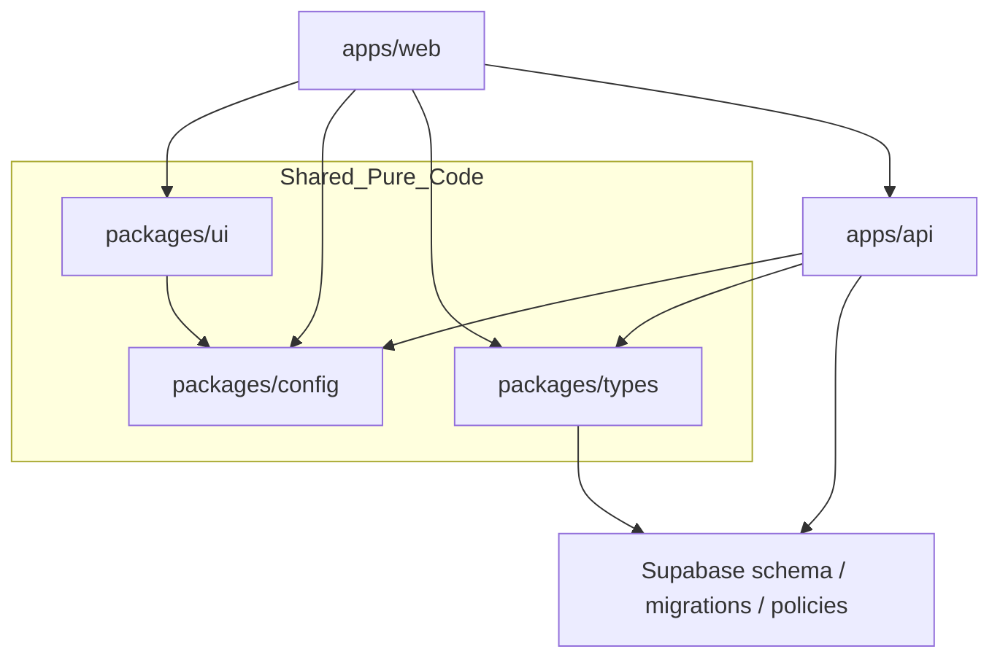

# Architecture Spine - Private Prediction Market

## Design Paradigm

Use a modular monorepo with a hexagonal Fastify API at the center and a thin React PWA client at the edge. Browser code owns presentation and session bootstrap only; all domain mutations flow through the API. Shared packages stay pure and framework-agnostic.

## Invariants & Rules

### AD-1 - The monorepo is split by runtime responsibility

- **Binds:** all capabilities
- **Prevents:** browser, server, and data access code from collapsing into one app
- **Rule:** keep browser code in `apps/web`, server code in `apps/api`, shared pure code in `packages/*`, and Supabase schema/policies in `supabase/`

### AD-2 - The web app never writes domain data directly

- **Binds:** FR-1 through FR-12
- **Prevents:** direct client-to-database coupling and bypassed authorization rules
- **Rule:** the web app may use Supabase for auth/session bootstrap, but all app-domain reads and writes go through the Fastify API

### AD-3 - Supabase is the system of record for identity and domain data

- **Binds:** FR-1 through FR-12
- **Prevents:** hidden alternate sources of truth
- **Rule:** authenticated identity, spaces, memberships, markets, bets, and standings live in Supabase-backed persistence; the API is the only writer of domain state

### AD-4 - Organizer-only actions are enforced server-side

- **Binds:** FR-1, FR-2, FR-4, FR-6, FR-10, FR-11
- **Prevents:** UI-only permission checks and accidental privilege escalation
- **Rule:** the API must verify organizer scope for space creation, invite generation, market management, and resolution actions

### AD-5 - Invite access is space-scoped and unguessable

- **Binds:** FR-2, FR-3
- **Prevents:** joining arbitrary spaces or enumerating private groups
- **Rule:** invite tokens are generated server-side, scoped to one space, and validated on acceptance before membership is created

### AD-6 - Offline behavior is read-only first

- **Binds:** FR-13, FR-14, FR-15
- **Prevents:** divergent offline writes that cannot be reconciled safely
- **Rule:** the PWA may cache recently viewed content for offline reading, but mutations require a live network path

### AD-7 - Shared packages stay pure

- **Binds:** all capabilities
- **Prevents:** hidden runtime side effects and circular app dependencies
- **Rule:** `packages/ui`, `packages/config`, and `packages/types` must not depend on app-specific runtime code or environment-specific side effects

### Dependency Direction



## Consistency Conventions

| Concern | Convention |
| --- | --- |
| Naming (entities, files, routes) | Singular nouns for domain entities; kebab-case for files; route names mirror domain nouns (`spaces`, `markets`, `bets`) |
| Data & formats | UUID primary keys; ISO-8601 timestamps; API responses use a consistent JSON envelope with `data`, `error`, and `meta` where needed |
| State & cross-cutting | Server is authoritative for permissions and mutations; client state is view state plus cached reads; structured logging on API boundaries only |

## Stack

| Name | Version |
| --- | --- |
| Node.js | 22.x LTS |
| pnpm | 10.x |
| React | 19.2.8 |
| React DOM | 19.2.8 |
| Vite | 8.2.0 |
| Tailwind CSS | 4.3.3 |
| Fastify | 5.11.0 |
| @supabase/supabase-js | 2.111.0 |

## Structural Seed

The scaffold should start with these repo boundaries:

```text
{root}/
  apps/
    web/        # React PWA client
    api/        # Fastify API and domain services
  packages/
    ui/         # shared presentational components and primitives
    config/     # shared TypeScript, lint, Tailwind, and build presets
    types/      # shared domain contracts and generated Supabase types
  supabase/
    migrations/ # schema migrations
    seed/       # seed data for local development
    policies/   # RLS and access policy definitions
```

## Capability -> Architecture Map

| Capability / Area | Lives in | Governed by |
| --- | --- | --- |
| FR-1, FR-2, FR-3 | `apps/api` space and invite services; `apps/web` auth flow | AD-2, AD-4, AD-5 |
| FR-4, FR-5, FR-6 | `apps/api` market services | AD-2, AD-3, AD-4 |
| FR-7, FR-8, FR-9 | `apps/api` bet services; `apps/web` market views | AD-2, AD-3, AD-6 |
| FR-10, FR-11, FR-12 | `apps/api` resolution and standings services | AD-3, AD-4 |
| FR-13, FR-14, FR-15 | `apps/web` PWA shell, caching, and installability | AD-1, AD-6, AD-7 |

## Deferred

- Exact deployment hosts for web and API are deferred; the current decision is only that they are separate services with Supabase as the backing platform.
- Real-money settlement, payments, and dispute handling are deferred.
- Push notifications and background jobs are deferred until the core create/join/bet/resolve loop is stable.
- Advanced analytics and leaderboards beyond basic standings are deferred.
- Native mobile apps are deferred; the PWA is the only client shell in v1.
