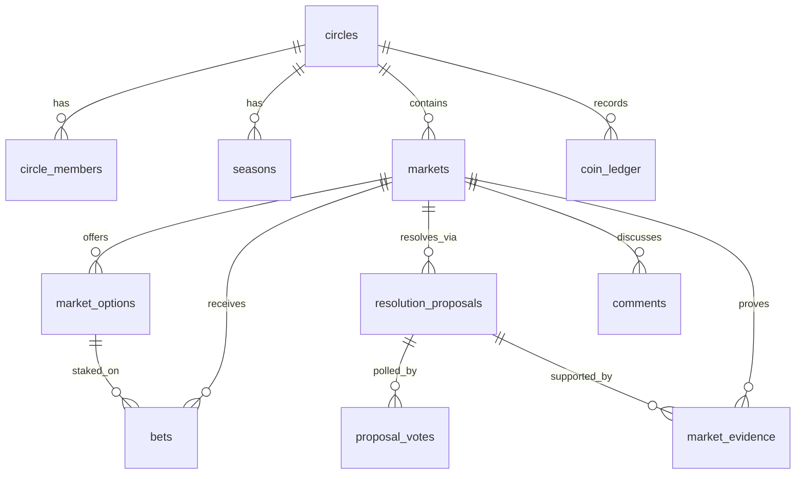

# Prediction Market — Backend Reference

Postgres/Supabase backend for a private, friends-only prediction market.
Schema file: `schema_v4.sql` (2,947 lines, single-file install).

---

## Contents

1. [What this is](#1-what-this-is)
2. [Deploying](#2-deploying)
3. [Data model](#3-data-model)
4. [RPC reference](#4-rpc-reference)
5. [Direct table access](#5-direct-table-access)
6. [Design decisions](#6-design-decisions)
7. [Operations](#7-operations)
8. [What has been tested](#8-what-has-been-tested)

---

## 1. What this is

People form **circles** (private friend groups joined by a 6-character code).
Each circle has its own coin economy. Members post **markets** (bets), stake
coins on outcomes, and settle up through an admin-approved resolution flow.

The governing principle throughout: **the browser is never trusted with money.**
Every coin movement runs through a `SECURITY DEFINER` Postgres function that
re-checks permissions server-side. The client has read access and can write to
exactly three tables (comments, evidence, push subscriptions). Nothing else.

**Core objects**

| Concept | Meaning |
|---|---|
| Circle | Private group. Owns its members, markets, and coin economy. |
| Season | A scoring period. Resetting one restores every balance to the circle's starting amount. |
| Market | A question plus a list of options. Four kinds (below). |
| Bet | A stake on one option. Pool-based, not an order book. |
| Proposal | A claim about the outcome, backed by a refundable bond. |
| Ledger | Append-only record of every coin that has ever moved. |

**Market kinds**

| `kind` | Options | Notes |
|---|---|---|
| `binary` | Auto: Yes / No | |
| `over_under` | Auto: Over N / Under N | `_line` must be a half-number (8.5), so ties are impossible |
| `multi` | From `_options` array | Minimum 2, deduplicated case- and whitespace-insensitively |
| `open` | Submitted by members | Submissions close 15 minutes before betting closes |

---

## 2. Deploying

1. Open the Supabase SQL Editor.
2. Paste `schema_v4.sql` in full and run it.
3. Confirm the output ends with `SELF-TEST PASSED`.

The script is idempotent — safe to re-run on an existing database. It creates
13 tables, 5 views, 36 functions, 5 triggers, and 20 RLS policies.

### Section 2.5 is not optional

Supabase no longer grants table access automatically. Projects created after
2026-05-30 default to "Automatically expose new tables" **off**, and from
2026-10-30 that applies to existing projects too.

Grants and RLS are separate layers. RLS decides *which rows* a role sees;
grants decide whether the role can touch the table **at all**. Without section
2.5 the schema installs perfectly and then every client call returns:

```json
{ "code": "42501", "message": "permission denied for table circles" }
```

Section 2.5 issues a deliberately minimal grant set and revokes first, so an
old project and a new project end in the same state.

### Post-install steps

| Step | Where | Needed for |
|---|---|---|
| Enable `pg_cron` | Database → Extensions | Market status transitions, "closing soon" alerts, notification pruning |
| Enable `pg_net` | Database → Extensions | Web push delivery |
| Store Vault secrets | SQL Editor | Push job (`project_url`, `publishable_key` — see section 12 comments) |
| Re-run section 12 | SQL Editor | Registers the cron jobs once the extensions exist |

Until `pg_cron` is on, `markets.status` never advances on its own. Betting
still behaves correctly because `place_bet` reads timestamps rather than
status, but list badges will look stale.

---

## 3. Data model



### Tables

| Table | Purpose | Key columns |
|---|---|---|
| `circles` | The group | `join_code`, `starting_balance`, `proposal_bond` |
| `seasons` | Scoring period | `is_active` (one per circle, enforced by partial unique index) |
| `circle_members` | Membership **and balance** | `(circle_id, user_id)` PK, `role`, `balance`, `display_name` |
| `markets` | The question | `kind`, `status`, four timestamps, `review_started_at`, `winning_option_id` |
| `market_options` | Choices | `label`, `sort_order` |
| `bets` | Stakes | `amount`, `status`, `payout`, `was_late`, `voided_at` |
| `resolution_proposals` | Outcome claims | `proposed_option_id`, `bond`, `status` |
| `market_evidence` | Photos/video | `storage_path`, `proposal_id` |
| `coin_ledger` | **Append-only** money log | `amount`, `reason`, `actor_id` |
| `comments` | Trash talk | `body` |
| `proposal_votes` | Advisory poll | `vote` |
| `notifications` | In-app alerts | `url`, `sent_at`, `read_at` |
| `push_subscriptions` | Web push endpoints | `endpoint`, `p256dh`, `auth` |

**Balance lives on `circle_members`, not on the user.** You can be broke in one
circle and rich in another.

### Market timestamps

Four separate fields, each with one job:

| Column | Meaning |
|---|---|
| `opens_at` | Betting starts |
| `closes_at` | Betting ends |
| `event_start_at` | The thing happens |
| `event_end_at` | The thing is over and knowable — gates `propose_resolution` |
| `options_lock_at` | Derived: `closes_at - 15 min` for `open` markets |

`status` progresses `scheduled → open → closed → resolved | voided`. It is
cosmetic: eligibility checks read timestamps directly.

### Views

| View | Use |
|---|---|
| `market_odds` | Per-option pool, bet count, and percentage |
| `leaderboard` | Per-circle standings, ranked by `net_profit` (not balance) |
| `season_leaderboard` | Same, scoped to a season |
| `proposal_vote_tally` | Approve/disapprove counts |
| `circle_reconciliation` | **Audit view. `drift` must always be 0.** |

All views are `security_invoker`, so they respect the caller's RLS.

### Ledger reasons

`initial_grant`, `admin_grant`, `bet`, `payout`, `refund`, `void_refund`,
`late_void_refund`, `proposal_bond`, `bond_refund`, `daily_bonus`,
`season_reset`, `member_removed`

---

## 4. RPC reference

All calls go through `supabase.rpc()`. Every function raises on failure —
the message is the exact string in the Errors column, so match on it directly.

```js
const { data, error } = await supabase.rpc('place_bet', {
  _market_id: 12, _option_id: 34, _amount: 100
})
if (error) showToast(error.message)   // e.g. "Not enough coins"
```

### 4.1 Circles and membership

| Function | Params | Returns | Errors |
|---|---|---|---|
| `create_circle` | `_name text` | `bigint` circle id | Not signed in · Could not generate a unique join code, please try again |
| `join_circle` | `_join_code text` | `bigint` circle id | Not signed in · Invalid join code |
| `leave_circle` | `_circle_id bigint` | void | The circle creator cannot leave… · You still have open bets… · You have a resolution bond in escrow… · Promote another admin before you leave · You are not a member of this circle |
| `rename_member` | `_circle_id bigint, _display_name text` | void | Display name too long · You are not a member of this circle |

`join_circle` is **idempotent** — case-insensitive, whitespace-tolerant, and
joining twice does not grant a second opening balance. Verified with 5 parallel
calls: one member row, one ledger grant, drift 0.

New members receive the circle's *current* `starting_balance`, and
`display_name` auto-fills from OAuth metadata (`full_name` → `name` →
`user_name` → email prefix → `Player`).

### 4.2 Admin

| Function | Params | Returns | Errors |
|---|---|---|---|
| `set_member_role` | `_circle_id bigint, _user_id uuid, _role text` | void | Only circle admins can change roles · Invalid role · The original circle creator cannot be demoted · A circle must keep at least one admin · That user is not in this circle |
| `remove_member` | `_circle_id bigint, _user_id uuid` | void | Only circle admins can remove members · Use leave_circle() to remove yourself · The circle creator cannot be removed · That member has open bets… · That member has a resolution bond in escrow… |
| `admin_adjust_coins` | `_circle_id bigint, _user_id uuid, _amount int, _note text` | `int` new balance | Amount cannot be zero · Only circle admins can adjust coins · That would put their balance below zero · That user is not in this circle |
| `set_circle_settings` | `_circle_id bigint, _starting_balance int, _proposal_bond int, _name text` | void | Only circle admins can change settings · Circle not found |
| `reset_season` | `_circle_id bigint, _new_name text` | `bigint` season id | Only circle admins can start a new season · Resolve or void every open market… · Review every pending resolution proposal… |

`_role` is `'member'` or `'admin'`. All `set_circle_settings` params except
`_circle_id` are optional; nulls leave the current value.

**Role rules:** the creator can never be demoted or removed. A circle always
keeps at least one admin. Any admin can promote or demote any non-creator,
including themselves. `admin_adjust_coins` accepts negatives to take coins away,
refuses to push a balance below zero, and ledgers every change with `actor_id`.

### 4.3 Markets

| Function | Params | Returns | Errors |
|---|---|---|---|
| `create_market` | `_circle_id, _question, _kind, _closes_at` + optional `_options text[]`, `_line numeric`, `_subject_id uuid`, `_opens_at`, `_event_start_at`, `_event_end_at`, `_image_url` | `bigint` market id | Not a member of this circle · Betting must close after it opens · The tagged person is not in this circle · Over/under needs a line · Use a half number for the line… · Multiple choice needs at least 2 options · Unknown market kind · Duplicate option: "x"… |
| `update_market` | `_market_id` + optional `_question`, `_image_url`, `_closes_at`, `_opens_at`, `_event_start_at`, `_event_end_at`, `_subject_id` | void | Market not found · That market has already settled · Only the market creator or a circle admin can edit this · Bets have been placed. Only the image can be changed now… · Bets have been placed. Only a circle admin can change the event timing now. |
| `cancel_market` | `_market_id bigint` | void | Market not found · That market has already settled and cannot be cancelled · Only the market creator or a circle admin can cancel this · Bets have been placed. Use void_market() to refund everyone instead. |
| `submit_option` | `_market_id bigint, _label text` | `bigint` option id | This market has fixed options · This market has settled · Option submissions have closed · This market has not opened yet · Betting has closed · Not a member · That option already exists |

**Editing rules.** Before any bet exists, the creator or an admin can change
anything. Once a bet exists the question, window, and subject freeze — only the
image stays editable, and **only an admin** can adjust event timing. That last
restriction closes a real exploit: `event_end_at` gates `propose_resolution`,
so a losing creator could otherwise push it to 2099 and make their own market
permanently unresolvable.

`cancel_market` hard-deletes and is only allowed when no bet exists. If bets
exist, use `void_market` to refund everyone instead.

### 4.4 Betting

| Function | Params | Returns | Errors |
|---|---|---|---|
| `place_bet` | `_market_id bigint, _option_id bigint, _amount int` | `int` new balance | Amount must be positive · This market has already settled · Betting has closed · Betting has not opened yet · Not a member of this circle · You cannot bet on a market about yourself · That option does not belong to this market · Not enough coins |

Balance check and deduction happen in a single statement, so two fast taps
cannot spend the same coins. Verified: 12 parallel 100-coin bets against a
500 balance → exactly 5 accepted.

### 4.5 Resolution

| Function | Params | Returns | Errors |
|---|---|---|---|
| `propose_resolution` | `_market_id bigint, _option_id bigint, _note text` | `bigint` proposal id | This market is already settled · Not a member · The event has not finished yet · That option does not belong to this market · Not enough coins to post the bond |
| `review_proposal` | `_proposal_id bigint, _action text` | void | Unknown action · Proposal not found or already reviewed · Only circle admins can review proposals |
| `vote_on_proposal` | `_proposal_id bigint, _vote text` | void | Invalid vote · Not a member of this circle · This proposal has already been reviewed |
| `clear_proposal_vote` | `_proposal_id bigint` | void | — |
| `resolve_market` | `_market_id bigint, _winning_option_id bigint` | void | Market already settled · Only circle admins can resolve markets · That option does not belong to this market |
| `void_market` | `_market_id bigint, _reason text` | void | Market already settled · Only circle admins can void a market |
| `void_bet` | `_bet_id bigint, _reason text` | void | Only circle admins can void bets · That market has already paid out · Bet not found or already voided |

`_vote` is `'approve'` or `'disapprove'`. Votes are **advisory only** — a tally
for the admin to look at. They bind nothing.

`_action` for `review_proposal`:

| Action | Effect |
|---|---|
| `approve` | Pays out immediately. Bond refunded. |
| `reject_reopen` | False alarm — betting continues, bond forfeited. |
| `reject_close` | Betting stops, market stays unresolved. |
| `void_market` | Everyone refunded, all bonds returned. |

The bond amount comes from `circles.proposal_bond` and is **not** a caller
parameter — it used to be, which meant anyone could pass `0` from devtools and
grief for free.

**One admin is enough.** There is no quorum anywhere. The first admin to
approve settles the market in the same transaction; a second admin's click
returns "Proposal not found or already reviewed."

### 4.6 Notifications

| Function | Params | Returns |
|---|---|---|
| `mark_notification_read` | `_notification_id bigint` | void |
| `mark_all_notifications_read` | — | void |

---

## 5. Direct table access

### Readable (SELECT, filtered by RLS to your circles)

`circles`, `seasons`, `circle_members`, `markets`, `market_options`, `bets`,
`resolution_proposals`, `market_evidence`, `coin_ledger`, `comments`,
`notifications`, `proposal_votes`, plus all five views.

### Writable — only these three

```sql
comments            INSERT, DELETE   -- own rows only
market_evidence     INSERT, DELETE   -- own uploads, and only before settlement
push_subscriptions  INSERT, UPDATE, DELETE, SELECT  -- own rows only
```

Everything else is function-only. Direct writes to `bets`, `circle_members`,
`coin_ledger`, `markets`, or `resolution_proposals` fail with
`permission denied for table` before RLS is even consulted.

### anon

No table access, no function access. Every circle is private, so the client
must have a session. A landing page needs to be static or served from data
outside this schema.

### Storage

Bucket `evidence`, private. Path convention:

```
<circle_id>/<market_id>/<uuid>.<ext>
```

Policies parse the path to check circle membership, so **paths must follow this
shape** or the upload is denied. Uploads and deletes are blocked once the market
settles, which keeps the proof behind a payout intact.

---

## 6. Design decisions

### Money moves only through functions

RLS filters *rows*, not *columns*. An "update your own row" policy on
`circle_members` would let anyone rewrite their own `balance` and set
`role = 'admin'`. So there is **no direct UPDATE policy** on that table, and
`admin_adjust_coins` / `rename_member` are the sanctioned paths.

Hiding a button is not security. Every function granted to `authenticated` is a
public HTTP endpoint the moment your anon key ships in a JS bundle.

### Pool odds, not an order book

Each option's odds are its share of the pot. With five friends there is nobody
to match against, so a matching engine would sit idle. Winners get their stake
back plus a proportional cut of the losing pool.

Shares are floored and the rounding remainder goes to the largest winning
stake, so coins in exactly equal coins out. Edge cases:

- **Everyone on the winning side** → losing pool is 0, stakes returned.
- **Nobody on the winning side** → everyone refunded.

### Late-bet quarantine

Proposing a resolution does **not** stop betting. It stamps
`markets.review_started_at`.

If a proposal is later approved, bets placed after that timestamp **on the
winning side** are voided and refunded. Late bets on losing sides stay in the
pot. So you cannot profit from knowing the answer, but a confident wrong sniper
still pays a tax to the honest players.

This only bites when a proposal is actually approved — a griefer's false alarm
gets rejected and every late bet reverts to being a normal bet.
`review_started_at` is never cleared, because the earliest proposal after the
event ended is the permanent quarantine line.

### Settlement is irreversible

Five `BEFORE` triggers make this a property of the tables, not a convention
each function has to remember:

| Trigger | Blocks |
|---|---|
| `markets_terminal_guard` | Any update/delete of a resolved or voided market |
| `bets_settled_guard` | Bet writes once the parent market settled |
| `proposals_reviewed_guard` | Changing a reviewed proposal or a posted bond |
| `ledger_append_only_guard` | All ledger deletes; any edit to amount, user, reason, actor, note, timestamp |
| `evidence_settled_guard` | Evidence changes after settlement |

These apply to the table owner and to `SECURITY DEFINER` functions too. That is
the point — see [Break-glass](#break-glass).

There is no "unresolve" function. `admin_adjust_coins` is the escape hatch: it
cannot rewrite history, but it can hand-correct balances, and every adjustment
is ledgered with `actor_id`.

### The ledger reconciles

Every coin that exists was written to `coin_ledger` — opening balances, bets,
payouts, refunds, bonds, admin grants, season resets, departures.

```sql
select * from public.circle_reconciliation;
-- drift must be 0
```

If drift is ever non-zero, some code path moved money without recording it.
That view is the single best health check for this system.

### Locking

Every money-moving function locks the market row first. Global order is
**markets → resolution_proposals → circle_members**, with `reset_season` using
**circles → circle_members**. The two orders share only their tail, so no cycle
is possible.

`place_bet` takes `FOR SHARE` (it never writes to `markets`), so concurrent
bets stay parallel while still blocking against a simultaneous resolve.

---

## 7. Operations

### Health check

```sql
select * from public.circle_reconciliation;   -- drift must be 0
```

Run it after your first few real markets, and any time something looks wrong.

### Re-running the self-test

Re-running the whole schema file is safe and ends in the self-test. It asserts
RLS is on for all 13 tables, all 5 guards are attached and enabled, the Data API
grants are correct, `anon` is locked out, every `SECURITY DEFINER` function pins
`search_path`, and no circle has drift.

### Cron jobs

```sql
select * from cron.job;
select * from cron.job_run_details order by start_time desc limit 20;
select cron.unschedule('market-lifecycle');
```

| Job | Schedule | Does |
|---|---|---|
| `market-lifecycle` | every 5 min | Advances `scheduled → open → closed` |
| `closing-soon-alerts` | every 15 min | Notifies members an hour before close |
| `prune-notifications` | daily 04:00 | Deletes notifications older than 30 days |
| `send-push` | every minute | Flushes unsent notifications via edge function |

### Break-glass

The immutability triggers block the owner too. To correct genuinely corrupt
data:

```sql
alter table public.markets disable trigger markets_terminal_guard;
-- ... your correction ...
alter table public.markets enable  trigger markets_terminal_guard;
select * from public.circle_reconciliation;   -- verify drift is still 0
```

**Deleting a whole circle** cascades into `markets` and `coin_ledger`, so two
guards must come down together:

```sql
alter table public.markets     disable trigger markets_terminal_guard;
alter table public.coin_ledger disable trigger ledger_append_only_guard;
delete from public.circles where id = <id>;
alter table public.markets     enable  trigger markets_terminal_guard;
alter table public.coin_ledger enable  trigger ledger_append_only_guard;
```

**Deleting an auth user** fails if they ever bet on a market that has since
settled — their stake is part of a settled pot, and removing it would silently
rewrite other people's payouts. For erasure, clear `display_name` and leave the
financial rows; they are keyed by uuid and carry no personal data.

### Troubleshooting

| Symptom | Cause |
|---|---|
| `42501 permission denied for table X` | Section 2.5 did not run, or a later migration revoked the grant |
| `permission denied for schema public` | Missing `grant usage on schema public` — different error, different fix |
| `permission denied for function X` | Calling as `anon`; the user has no session |
| Market stuck as `scheduled` | `pg_cron` not enabled. Betting still works; only the badge is stale |
| Evidence upload denied | Storage path is not `<circle_id>/<market_id>/<file>` |
| `infinite recursion detected in policy` | A policy is reading `circle_members` directly instead of via `is_circle_member()` |
| Push notifications never arrive | `pg_net` off, or Vault secrets not set |

### Error handling in the UI

Server errors surface as raw Postgres messages. Worth mapping to friendly text
at minimum: "Not enough coins", "Betting has closed", "You cannot bet on a
market about yourself", "Bets have been placed…", and the settled-market
rejections.

Three cases surface as raw constraint violations rather than clean messages —
question shorter than 3 characters, a second pending proposal from the same
user, and out-of-range circle settings. All correctly rejected, just ugly.

---

## 8. What has been tested

Executed against real PostgreSQL 16.2 with a Supabase-emulating harness
(`auth.users`, `auth.uid()`, `storage`, the three roles), using a **strict**
configuration with no default privileges — matching a Supabase project created
today.

| Area | Result |
|---|---|
| Install | Clean on fresh DB; idempotent on re-run; v2 → v3 → v4 upgrades preserve data |
| Lifecycle | Create → join → market → bets → propose → approve → payout, all four market kinds |
| Roles | Promote, demote, owner-demotes-admin, admin-removes-admin, last-admin and creator protections |
| Coins | Grant, revoke, exact-to-zero, below-zero refusal, non-member, non-admin |
| Resolution | All four review actions, nobody-on-winning-side, competing proposals, bond forfeit/refund |
| Exploits | 60+ attempts blocked: balance rewrites, self-promotion, forged ledger rows, direct inserts, settled-market edits, cross-market references, anon access |
| Concurrency | 0 deadlocks. No double-spend (12 parallel bets, 5 accepted). No stuck bets (20 bets racing a resolve). Dual-admin approval, 8 concurrent proposals, concurrent season resets and joins |
| Reconciliation | drift = 0 at every checkpoint |

### Known limits of that testing

- The harness is **not** PostgREST, real JWTs, `pg_cron`, `pg_net`, or the
  Storage API. Storage policies were exercised as SQL expressions, not through
  real uploads.
- Supabase runs PG 15 or 17; testing was on 16.2. Nothing here uses
  version-specific syntax, but that is reasoning rather than a test.
- `markets_terminal_guard` covers UPDATE and DELETE but not INSERT, so a
  superuser could insert a row already marked `resolved`. Not client-reachable
  (RLS blocks direct inserts to `markets`), and anyone who could do it could
  disable the trigger anyway.
- `007/2/x.jpg` resolves to circle 7 — leading zeros normalize. Not exploitable
  since membership is still checked.

---

## Appendix: version history

| Version | Change |
|---|---|
| v2 | Bond moved server-side; locking added to `place_bet`/`void_bet`; timestamp-driven eligibility; ledger reconciliation; seasons wired up; leave/remove/update/cancel added |
| v3 | **Section 2.5 Data API grants.** Without it the schema installs and every client read returns 42501 |
| v4 | `options_lock_at` recalculated when `update_market` moves the window; `cancel_market` clears orphaned notifications; hard `closes_at` ceiling in `submit_option` |
